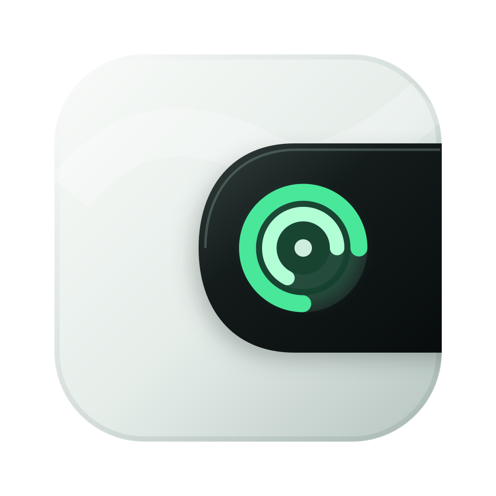
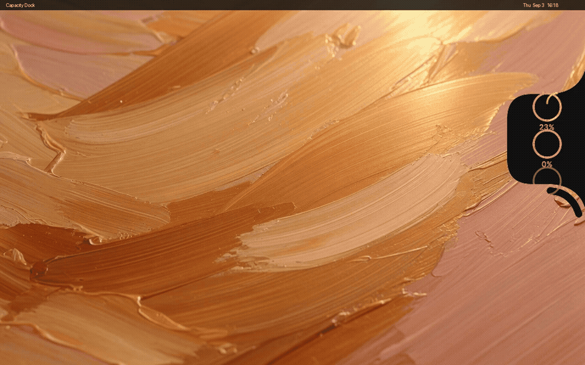
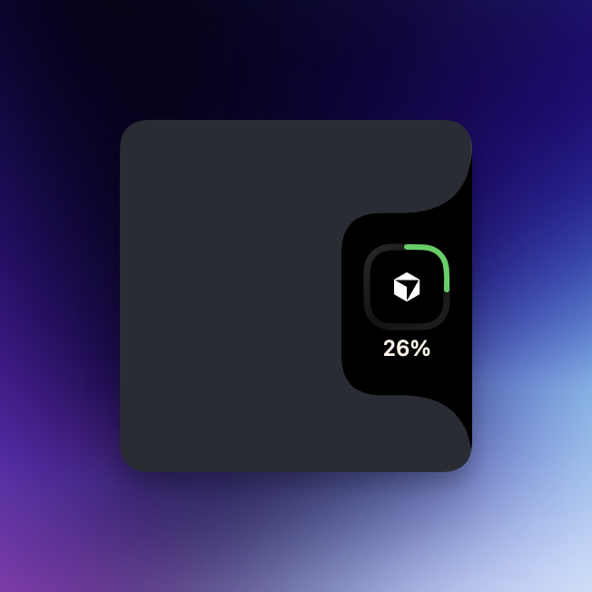
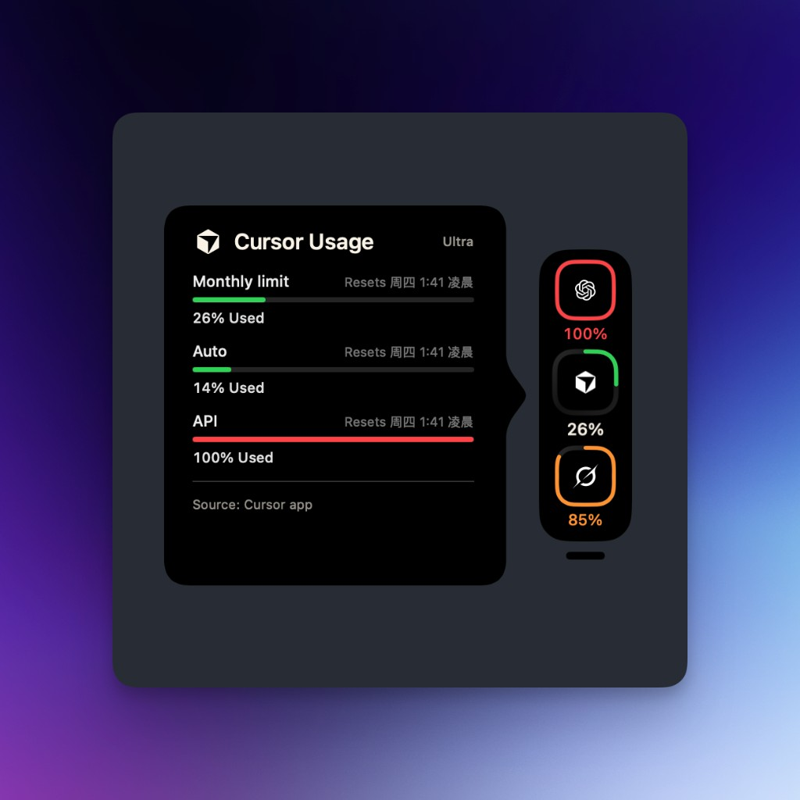

<p align="center">
  
</p>

<h1 align="center">Capacity Dock</h1>

<p align="center">
  macOS 屏幕边缘的有机黑槽用量条。<br>
  一眼看 Grok、Claude、Copilot、Codex 等 AI 配额，悬停展开详情。
</p>

<p align="center">
  <a href="https://github.com/Dmao233/capacity-dock/releases/latest"></a>
  <a href="LICENSE"></a>
  <a href="README.en.md"></a>
</p>

<p align="center">
  <a href="README.en.md">English</a>
  ·
  <a href="#安装">安装</a>
  ·
  <a href="#使用">使用</a>
  ·
  <a href="https://github.com/Dmao233/capacity-dock/releases/latest">下载</a>
  ·
  <a href="LICENSE">MIT</a>
</p>

<p align="center">
  
</p>

<p align="center">
  
  &nbsp;
  
</p>

## 这是什么

Capacity Dock 是一个 macOS 14+ 的菜单栏附属应用（无 Dock 图标）。它把各家 AI 的配额收成贴在屏幕边缘的黑色有机槽：

- **待机**只显示当前首选服务商的一枚环
- **悬停**沿下方弧度展开已选服务商，并打开向内的详情气泡
- **常驻展开**让待机就显示全部环，详情仍随鼠标关掉
- 停靠在左 / 右 / 上 / 下，或拖成独立胶囊
- 设置齿轮活在槽外：贴着底部勺形弧的短弧，悬停胀成齿轮

本仓库把这套表面做成可独立编译、可安装的小工具。几何、悬停和详情卡片源码来自 [CodeBurn](https://github.com/getagentseal/codeburn) 的 Capacity Dock（MIT）。开箱环上是 `-`，不是假用量；把真实数字写进 `quota.json`。

## 功能

| | |
| --- | --- |
| 有机黑槽 | 顶部勺形锁定，高度变化时上沿不动 |
| 配额环 | 周额度优先；未绑定显示单个 `-` |
| 详情气泡 | 进度、重置倒计时、套餐、Connect / Reconnect |
| SuperGrok Heavy | 计划名收成 `Heavy` |
| 右键菜单 | 常驻展开、停靠边缘、隐藏 |
| 跨桌面 | 跟随所有 Space，不钉死在第一次出现的桌面 |
| 中英界面 | 系统语言为简体中文时走 `zh-Hans` |

## 安装

需要 **macOS 14 Sonoma** 或更新。

### 下载安装包

从 [Releases](https://github.com/Dmao233/capacity-dock/releases/latest) 下载其一：

| 文件 | 用法 |
| --- | --- |
| `CapacityDock-*.pkg` | 双击安装到 `/Applications`，装完会自动打开 |
| `CapacityDock-*.dmg` | 打开后把应用拖到 **Applications** |
| `CapacityDock-*.zip` | 解压后把 `CapacityDock.app` 拖进 `/Applications` |

这是 ad-hoc 签名的通用二进制（Apple Silicon + Intel）。浏览器下载后 Gatekeeper 可能会拦一次：在 Finder 里对 `.pkg` / 应用 **右键 → 打开**，或：

```bash
xattr -d com.apple.quarantine ~/Downloads/CapacityDock-*.pkg
xattr -d com.apple.quarantine /Applications/CapacityDock.app
```

应用是 `LSUIElement`，不会出现在 Dock。菜单栏右侧会有一个 `◉` 入口，用来重新显示、打开设置或退出。

### 从源码构建

需要 **Swift 6**（随 Xcode 16 或 [swift.org](https://www.swift.org/install/macos/)）。

```bash
git clone https://github.com/Dmao233/capacity-dock.git
cd capacity-dock
swift test
Scripts/package-app.sh 0.2.0
open .build/dist/CapacityDock.app
```

日常开发直接：

```bash
swift run
```

## 使用

1. 第一次启动默认停在屏幕右缘，首选环是 Grok（可在设置里改）。
2. 把指针放到槽上：短暂延迟后展开其余环，并打开详情。
3. 左键点某一环：把它设为首选，并显示该服务商详情。左键**不会**钉住展开。
4. 移开指针：详情关掉；若未打开常驻展开，槽收回成一枚环。
5. 右键槽：
   - **常驻展开**：待机就显示全部已选环，详情仍随鼠标关
   - **停靠到边缘**：左 / 右 / 上 / 下
   - **隐藏侧边额度栏**：从屏幕拿掉，用菜单栏入口再打开
6. 点槽外的设置齿轮，或菜单栏里的「侧边额度栏设置…」。设置里可以检查 GitHub 上的新版本。

拖动槽可以换边。贴到边缘会重新长出勺形接触；拉到桌面中间则变成圆角胶囊，设置条改到尾部。

## 配额数据

Codex、Claude、Grok、Cursor 会读本机已经登录的 CLI / 应用，不把 token 再存一份。

| 服务商 | 怎么连上 |
| --- | --- |
| Codex | 本机有 `~/.codex/auth.json`（`codex login`）就会自动拉 |
| Grok | 本机有 `~/.grok/auth.json`（`grok login`）就会自动拉 |
| Cursor | 已登录 Cursor.app，读它的本地 session |
| Claude | 有 `~/.claude/.credentials.json` 会自动拉；只有钥匙串时，第一次点详情里的 Connect |

未登录显示 `-`。也可以手写覆盖文件：

```
~/Library/Application Support/CapacityDock/quota.json
```

示例见 [`docs/quota.example.json`](docs/quota.example.json)：

```json
{
  "providers": {
    "grok": {
      "displayName": "Grok",
      "plan": "Heavy",
      "footer": [],
      "windows": [{ "label": "Weekly", "percent": 0.23 }]
    }
  }
}
```

`percent` 是 0…1。保存后在设置里点「重新加载 quota.json」，或重启应用。

Copilot 等其余服务商仍可用 `quota.json` 填数。本仓库不伪造用量。

## 开发

```
Sources/CapacityDock/     槽、悬停、详情、演示配额、设置
Tests/CapacityDockTests/  Swift Testing，几何 / 交互 / 偏好
Scripts/package-app.sh    打成 ad-hoc 签名的 .app
assets/                   应用图标、真机截图、演示 GIF / MP4
```

改槽的形状或悬停时，请跑：

```bash
swift test
```

## 致谢

- 槽的实现从 [CodeBurn](https://github.com/getagentseal/codeburn) 抽出，版权见 [NOTICE](NOTICE)。
- 设计稿：[CodeBurn Capacity Dock on Figma](https://www.figma.com/design/RxGVxLJ3okxSKYnquk4ysI/CodeBurn-Capacity-Dock)

## 许可

[MIT](LICENSE)。Copyright (c) 2026 AgentSeal、CenFangyu。
