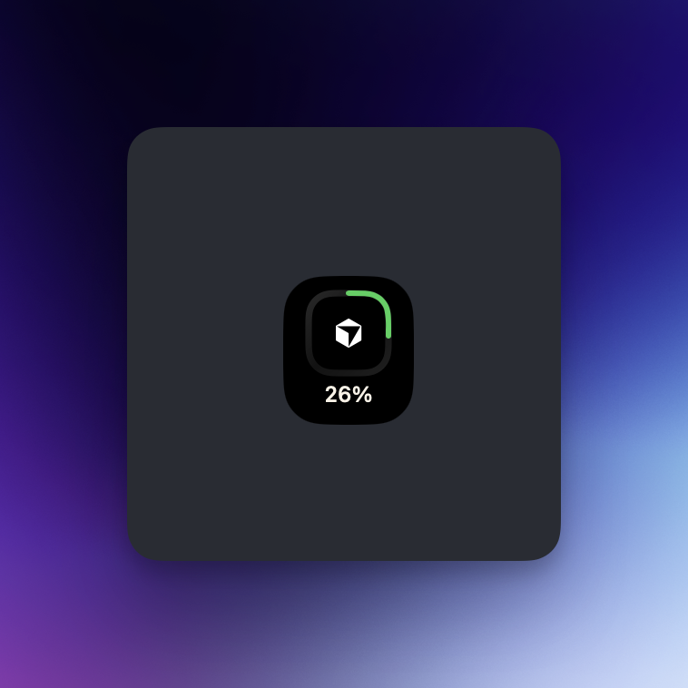
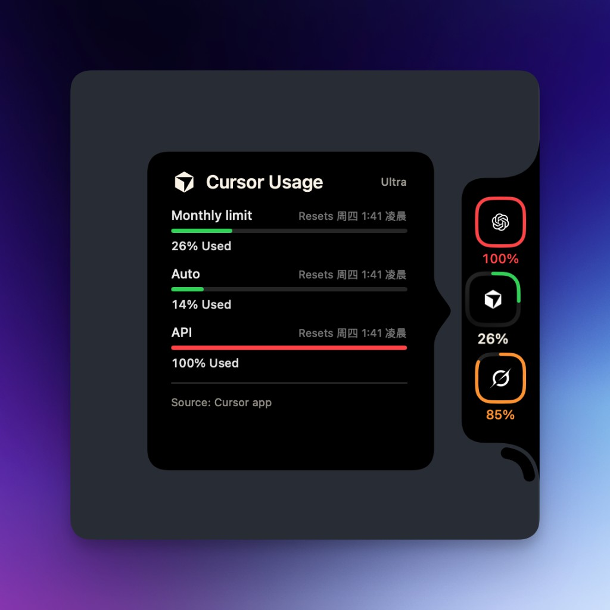

<p align="center">
  
</p>

<h1 align="center">Capacity Dock</h1>

<p align="center">
  贴在屏幕边缘的配额环。<br>
  一眼看 Cursor、Codex、Grok 等真实用量，悬停打开详情。
</p>

<p align="center">
  <a href="https://github.com/Dmao233/capacity-dock/releases/latest"></a>
  <a href="LICENSE"></a>
  <a href="README.en.md"></a>
</p>

<p align="center">
  <a href="README.en.md">English</a>
  ·
  <a href="#安装">安装</a>
  ·
  <a href="#使用">使用</a>
  ·
  <a href="https://github.com/Dmao233/capacity-dock/releases/latest">下载</a>
  ·
  <a href="LICENSE">MIT</a>
</p>

<p align="center">
  
</p>

<p align="center">
  
  &nbsp;
  
</p>

<p align="center">
  
  &nbsp;
  
</p>

## 这是什么

Capacity Dock 是 macOS 14+ 的菜单栏附属应用，没有 Dock 图标。它把各家 AI 的真实配额贴在屏幕边缘：没登录就是 `-`，不编造用量。

待机只留当前首选环。悬停展开已选服务商，并向内打开详情：进度、重置时间、套餐。正在用的会话会出现在 `Source:` 下面：小字工作区 + 会话标题。菜单栏显示今天的估算金额，左键打开消耗概览，右键打开设置。

几何、悬停和详情卡片来自 [CodeBurn](https://github.com/getagentseal/codeburn) 的 Capacity Dock（MIT）。本仓库做成可安装的独立小工具。

## 功能

| | |
| --- | --- |
| 边缘用量槽 | 贴在屏幕左 / 右 / 上 / 下，或拖到桌面变成胶囊 |
| 配额环 | 待机只留首选环；悬停展开已选服务商和详情 |
| 详情 | 进度、重置时间、套餐、连接；进行中任务显示工作区和会话标题 |
| 本机读取 | Codex、Claude、Cursor、Gemini、Antigravity、Copilot、Kimi Code、Grok 读本机登录；ClinePass、Z.ai 也可在设置里填密钥 |
| 设置 | 左侧边栏：通用 / 消耗 / 关于 / 服务商，可检查更新 |
| 消耗概览 | 菜单栏显示今日估算金额；点击后在下方打开紧凑账单，按今天 / 近 7 天 / 本月查看汇总 |
| 图表与明细 | 用量构成、独立近 30 天趋势、近 81 天活动热力图；悬停查看当天模型用量与估算金额 |
| 模型 / 服务商 | 下方分组切换、展开 token 明细，保留固定币种入口 |
| 外观与动效 | 默认深色紫色，设置全页与账单统一，可选浅色或跟随系统；周期 / 图表统一滑动选中反馈，图表切换居中、金额过渡、行悬停反馈，刷新指示在空闲时停止 |
| 多币种 | USD、CNY、EUR 等 19 种展示币种，缓存汇率并保留原始 USD 估算 |
| 菜单栏入口 | 左键消耗概览、右键设置；隐藏侧栏后可从这里恢复，不占 Dock |
| 跟桌面走 | 所有 Space 都在，不会钉在第一次出现的那一屏 |
| 中英 | 系统语言是简体中文时用中文 |

## 安装

需要 **macOS 14 Sonoma** 或更新。

### 下载安装包

从 [Releases](https://github.com/Dmao233/capacity-dock/releases/latest) 下载其一：

| 文件 | 用法 |
| --- | --- |
| `CapacityDock-*.pkg` | 双击安装到 `/Applications`，装完会自动打开 |
| `CapacityDock-*.dmg` | 打开后把应用拖到 **Applications** |
| `CapacityDock-*.zip` | 解压后把 `CapacityDock.app` 拖进 `/Applications` |

这是 ad-hoc 签名的通用二进制（Apple Silicon + Intel）。浏览器下载后 Gatekeeper 可能会拦一次：在 Finder 里对 `.pkg` / 应用 **右键 → 打开**，或：

```bash
xattr -d com.apple.quarantine ~/Downloads/CapacityDock-*.pkg
xattr -d com.apple.quarantine /Applications/CapacityDock.app
```

应用是 `LSUIElement`，不会出现在 Dock。菜单栏右侧会有一个 `◉` 入口，用来重新显示、打开设置或退出。

### 从源码构建

需要 **Swift 6**（随 Xcode 16 或 [swift.org](https://www.swift.org/install/macos/)）。

```bash
git clone https://github.com/Dmao233/capacity-dock.git
cd capacity-dock
swift test
Scripts/package-app.sh 0.3.1
open .build/dist/CapacityDock.app
```

日常开发直接：

```bash
swift run
```

## 使用

1. 第一次启动默认停在屏幕右缘，首选环是 Grok（可在设置里改）。
2. 把指针放到槽上：短暂延迟后展开其余环，并打开详情。
3. 左键点某一环：把它设为首选，并显示该服务商详情。左键**不会**钉住展开。
4. 移开指针：详情关掉；若未打开常驻展开，槽收回成一枚环。
5. 右键槽：
   - **常驻展开**：待机就显示全部已选环，详情仍随鼠标关
   - **停靠到边缘**：左 / 右 / 上 / 下
   - **隐藏侧边额度栏**：从屏幕拿掉，用菜单栏入口再打开
6. 点槽外的设置齿轮，或右键菜单栏 `◉` 打开设置。左侧是通用 / 消耗 / 关于 / 服务商列表，也可以检查 GitHub 上的新版本。左键 `◉` 在图标下方打开本机 token 账单。
7. 悬停某家环时，若该服务商正在用，详情里 `Source:` 下面会出现绿圈、工作区小字和会话标题，最多 3 条。

拖动槽可以换边。贴到边缘会重新长出勺形接触；拉到桌面中间则变成圆角胶囊，设置条改到尾部。

## 消耗概览（0.3.1）

点击菜单栏金额即可打开图标下方的账单面板。原来的边缘配额环继续用于查看套餐配额。

- **一致界面**：菜单栏弹出面板与设置中的“消耗”页复用同一套主题、汇总、图表、悬停明细和币种控件，共享读取缓存。
- **周期汇总**：左对齐的今天、近 7 天、本月按钮与居中的图表按钮使用一致的滑动选中反馈，模型 / 服务商指示线同步过渡。周期控制大金额、调用次数、输入 / 输出 / 缓存用量，以及下方模型和服务商明细。
- **独立趋势**：即使选择今天，趋势图仍显示最近 30 天；悬停柱子查看日期、当天总用量、各模型的用量和估算金额。
- **活动热力图**：最近 81 天按三行排列，每天一个固定大小的小方块，颜色分四档。悬停同样有当天明细；无记录与实测零消耗分开表示。
- **外观**：右上角「更多」选择默认深色紫色，设置全页与账单统一，可选浅色或跟随系统；底部选择展示币种。动效尊重系统的「减少动态效果」。
- **历史读取**：按文件指纹复用日志缓存，合并重复请求，流式读取时及时释放临时内存；缓存未变化时不重写，分条编码降低临时开销，按周期直接筛选缓存事件。首次读取大量历史日志仍可能较慢，界面会显示读取进度；后续周期切换可复用缓存。后台每分钟检查一次，打开页面仍使用 30 秒有效期，手动刷新可立即重读。

本机账单读取 Codex、Claude、Grok、Cursor 和 Cursor Agent 的 token 日志，金额是 **API 等价估算，不是订阅账单或实际扣费**。本版补齐 `gpt-6-astra` 的估算单价与长上下文档位。未定价模型仍保留用量，不把未知价格当作已确认的零费用。

币种仅影响显示，原始估算保持 USD。非 USD 币种需要汇率；无可用缓存且汇率获取失败时保持原币种并提示。选择币种还会同步到 `~/.config/codeburn/config.json` 的币种字段，方便与 CodeBurn 配合使用，保留该文件的其他设置。

## API 余额（开发版，尚未发布）

在设置的 **API 账户** 中添加 DeepSeek 官方账户或自定义中转站。保存时将密钥写入 macOS 钥匙串，并开始查询余额；编辑时密钥留空保留，改变接口地址必须重新填写密钥。

- 单账户菜单栏显示 **服务商图标 剩余余额 ｜ ◉ 今日消耗总计**；未添加账户时保持原样。
- 右侧仍是现有本地日志的 API 等价估算，今天 / 近七天 / 本月统计保持原有口径，**并非 API 平台实际扣费**。左侧余额不加入右侧费用。
- DeepSeek 使用官方 `/user/balance`，保留 CNY / USD 原币种，账户详情显示充值与赠送余额。
- 自定义中转站支持 HTTPS GET 余额接口，凭据方式为 `Authorization: Bearer <key>`。配置完整 URL、金额 JSON 路径（如 `data.balance`、`data.0.quota`）、币种及单位除数。以分为单位填 `100`；平台内部 quota 单位请按其文档填写，不能猜测倍率。
- 此通用适配不自动探测接口，不支持 Cookie 登录、POST、额外鉴权头或任意脚本。兼容 OpenAI 聊天接口不代表提供余额接口；需使用该中转站的文档。
- 多账户按币种分别汇总，不混加人民币和美元；不要重复添加同一账户的多个 Key，以免重复计算账户余额。有账户尚未查询成功时，总余额显示 `—`。
- 正常约每分钟更新，失败后退避至五分钟，可手动刷新。`↻` 表示上次余额，展开余额栏查看更新时间和错误；查询失败不伪造为零。
- 小型独立余额缓存、串行合并刷新、15 秒请求超时和 256 KiB 响应上限，不触发账单日志重扫。凭据不随重定向转发。

此版本提供余额读取，未使用余额差额冒充今日实际费用，也未实现中转站的历史扣费明细接口。

## 配额数据

多数服务商读本机已经登录的 CLI / 应用，不把来源凭证再存一份。ClinePass 和 Z.ai 用设置页保存的 API 密钥。

| 服务商 | 怎么连上 |
| --- | --- |
| Codex | 本机有 `~/.codex/auth.json`（`codex login`）就会自动拉 |
| Claude | 有 `~/.claude/.credentials.json` 会自动拉；只有钥匙串时，第一次点详情里的 Connect |
| Cursor | 已登录 Cursor.app，读本地 session，走 `api2.cursor.sh` |
| Grok | 本机有 `~/.grok/auth.json`（`grok login`）就会自动拉 |
| Gemini | 读 `~/.gemini/oauth_creds.json` |
| Copilot | 读本机 Copilot / `gh` / 环境变量里的 GitHub token |
| Antigravity | 探活本机 language server / `agy` |
| Kimi Code | 读 `~/.kimi-code/credentials/kimi-code.json` |
| ClinePass | 设置页粘贴 API 密钥后「保存并连接」 |
| Z.ai | 设置页 API 密钥，或本机 Pi 登录 |

未登录显示 `-`。也可以手写覆盖文件：

```
~/Library/Application Support/CapacityDock/quota.json
```

示例见 [`docs/quota.example.json`](docs/quota.example.json)：

```json
{
  "providers": {
    "grok": {
      "displayName": "Grok",
      "plan": "Heavy",
      "footer": [],
      "windows": [{ "label": "Weekly", "percent": 0.23 }]
    }
  }
}
```

`percent` 是 0…1。保存后在设置里点「重新加载 quota.json」，或重启应用。本仓库不伪造用量。

## 开发

```
Sources/CapacityDock/     槽、悬停、详情、本机配额、设置
Tests/CapacityDockTests/  Swift Testing，几何 / 交互 / 偏好
Scripts/package-app.sh    打成 ad-hoc 签名的 .app
assets/                   应用图标、真机截图、演示 GIF / MP4
```

改槽的形状或悬停时，请跑：

```bash
swift test
```

## 致谢

- 槽的实现从 [CodeBurn](https://github.com/getagentseal/codeburn) 抽出，版权见 [NOTICE](NOTICE)。
- 消耗概览参考 CodeBurn 的布局、悬停明细与缓存策略；活动方块和动效参考 [Rare UI](https://www.rareui.com/components/githubactivity)，使用原生 SwiftUI 实现。
- 设计稿：[CodeBurn Capacity Dock on Figma](https://www.figma.com/design/RxGVxLJ3okxSKYnquk4ysI/CodeBurn-Capacity-Dock)

## 许可

[MIT](LICENSE)。Copyright (c) 2026 AgentSeal、CenFangyu。
